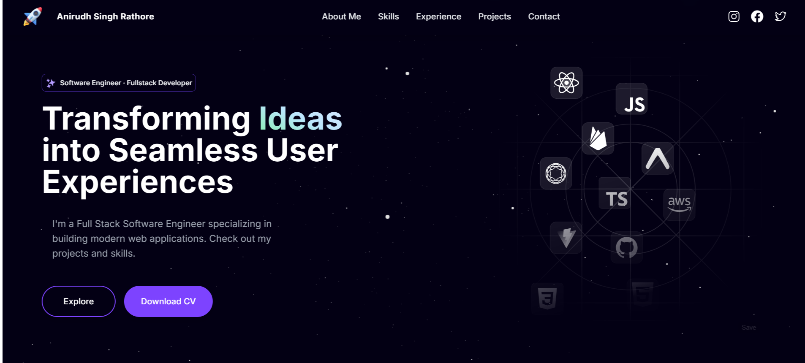
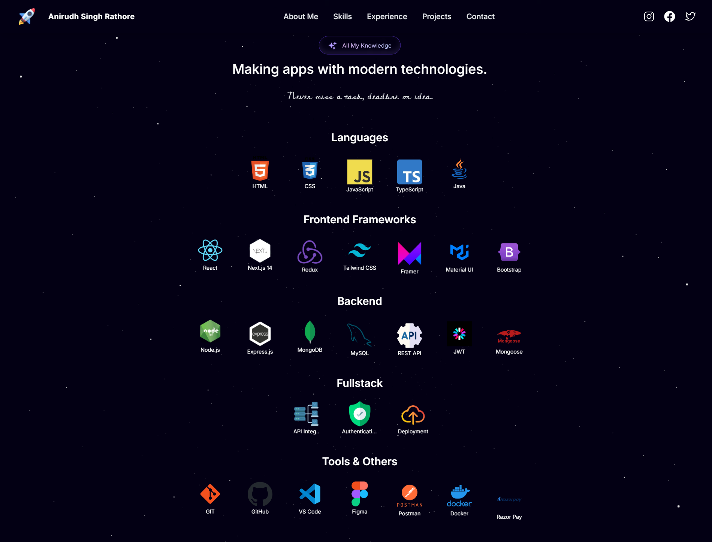
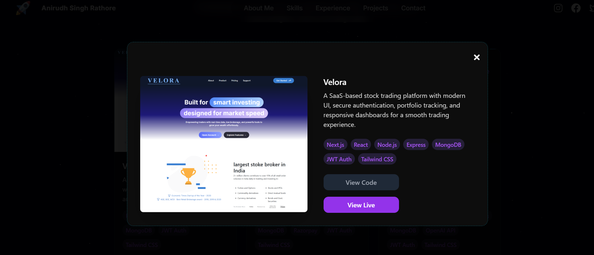

# 🌌 Galaxy Portfolio



**Galaxy Portfolio** is a visually immersive and fully responsive personal portfolio website inspired by the universe. Built with **Next.js** and **TypeScript**, it features modern design, interactive animations, and a dynamic 3D starfield background that adapts perfectly to all screen sizes, providing a smooth experience across desktops, tablets, and mobile devices.

🔗 **Live Demo:** [https://galaxy-portfoli.vercel.app/](https://galaxy-portfoli.vercel.app/)

---

## 💻 Project Overview

Galaxy Portfolio showcases projects, skills, and contact information in a creative, space-themed layout. It uses **Three.js** for a real-time starfield effect and **Framer Motion** for fluid animations. The responsive design ensures optimal viewing on any device, while interactive elements enhance user engagement.



---

## 🛠 Technology Stack

* **Next.js** + **TypeScript**: Framework and type-safe development
* **Tailwind CSS**: Utility-first, responsive styling
* **Framer Motion**: Smooth animations and transitions
* **Three.js**: 3D starfield and cosmic effects
* **React Intersection Observer**: Scroll-based animations
* **Vercel**: Deployment and hosting

---

## ✨ Key Features

* Fully responsive, mobile-friendly galaxy-themed interface
* Immersive 3D starfield background with Three.js
* Smooth animations and transitions powered by Framer Motion
* Interactive UI with hover and scroll-triggered effects
* Sections for About, Projects, Skills, and Contact
* Optimized for performance and SEO
* Clean, maintainable codebase using TypeScript
* Modern design with attention to usability and accessibility

---

## 🚀 Getting Started

### 1. Clone the Repository

```bash
git clone https://github.com/Anirudh-Singh-26/Galaxy_Portfoli.git
cd Galaxy_Portfoli
```

### 2. Install Dependencies

```bash
npm install
```

### 3. Run Development Server

```bash
npm run dev
```

Open [http://localhost:3000](http://localhost:3000) to view the portfolio locally.

### 4. Production Build

Build the project:

```bash
npm run build
```

Start the production server:

```bash
npm run start
```

---

## 🖼 Additional Screenshots



*Explore more sections and animations directly on the live demo!*

---

## 👤 Author

Anirudh Singh Rathore
[GitHub Profile](https://github.com/Anirudh-Singh-26)

---

## 📄 License

MIT © Anirudh Singh Rathore
